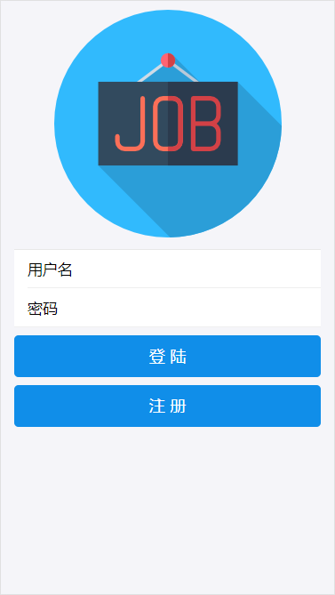
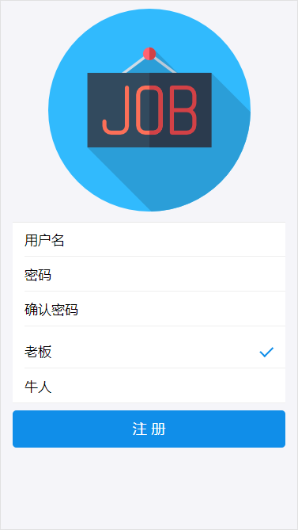
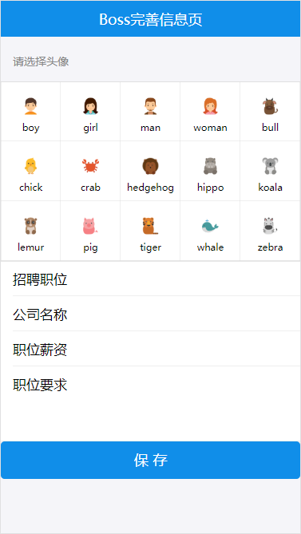
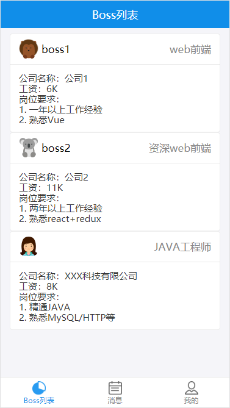
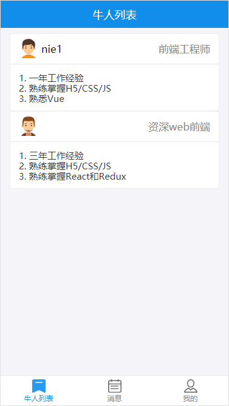
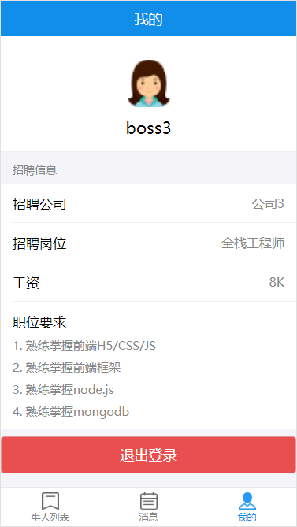

## 1. 项目预览
这是一款有实时聊天功能的招聘APP。<br>
页面有：
+ 登录/注册页面<br>
&nbsp;&nbsp;
+ 信息完善页面<br>

+ BOSS列表/牛人列表<br>
&nbsp;&nbsp;
+ 个人中心<br>

+ 消息列表<br>

+ 聊天详情页面<br>


## 2. 技术栈

此APP使用的技术栈有：

+ 前端
   + React + Redux
   + React-Router 4 路由
   + antd-mobile UI组件库
   + axios 异步请求
+ 后端
   + node.js + express
   + socket.io 实现实时通讯
+ 数据库
   + mongodb 数据库

## 3. 运行

+ 启动mongodb数据库<br>
打开CMD，运行：
  ```bash
  mongod -dbpath F:/Database/mongodb/myproject
  ```
+ 启动后端服务<br>
在server文件夹中运行：
  ```bash
  nodemon server
  ```
+ 启动前端服务<br>
在项目所在根目录下运行：
  ```bash
  yarn start
  ```
+ 在浏览器中访问：
  ```bash
  http://localhost:3000/
  ```